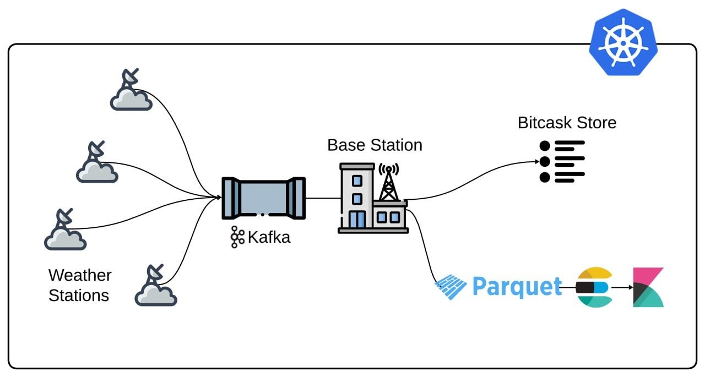

# Distributed IoT Weather Monitoring System

In the ever-evolving digital landscape, the Internet of Things (IoT) generates vast amounts of data at unprecedented frequency. Efficiently processing and analyzing these continuous data streams is critical, particularly for real-time, distributed systems.

This project, developed at **Alexandria University – Faculty of Engineering, Computers & Systems Engineering Department**, addresses these challenges through a scalable, cloud-native weather monitoring platform built around streaming, storage, and analytics technologies.

## Project Overview

The system simulates and processes real-time data from a distributed network of weather stations. Each station emits readings every second, producing a high-throughput data stream that must be reliably ingested, processed, stored, and analyzed.

The architecture is deployed on a Kubernetes cluster and integrates Kafka for streaming, Bitcask and Parquet for storage, and ElasticSearch with Kibana for analytics and visualization.

## Key Features

- **Real-Time Data Streaming**  
  Weather stations publish sensor readings every second, enabling continuous and up-to-date monitoring.

- **Efficient Data Storage**  
  - **Bitcask (Riak LSM)** for fast access to the latest station state  
  - **Parquet files** for compact, long-term historical storage

- **Advanced Data Analysis & Visualization**  
  ElasticSearch and Kibana provide insights into:
  - Battery status distribution
  - Message drop rates
  - Weather trends and anomalies

## System Architecture

The Kubernetes cluster consists of:
- 10 simulated weather stations
- Apache Kafka
- Zookeeper
- ElasticSearch
- Kibana
- Central processing and storage services

## Implementation Details

### Weather Station Simulation
- Generates periodic sensor readings
- Simulates varying battery levels
- Introduces random message drops to reflect real-world network conditions

### Kafka Integration
- Weather stations publish data using Kafka’s Producer API
- Kafka serves as the backbone for reliable, scalable data ingestion

### Rain Detection Triggers
- Kafka stream processors analyze humidity levels
- High humidity readings trigger rain detection alerts

### Central Station
- Maintains the latest state of each weather station using Bitcask
- Archives all incoming data into Parquet files for historical analysis

### Data Analysis Pipeline
- Weather data is indexed into ElasticSearch
- Kibana dashboards visualize system metrics and environmental data

## Objectives

- Design a scalable, fault-tolerant IoT data pipeline
- Handle high-frequency data streams efficiently
- Enable real-time insights and long-term analytics
- Explore distributed systems concepts using production-grade tools

## Status

This project serves as an academic and experimental exploration of distributed stream processing, storage optimization, and observability in large-scale IoT systems.

